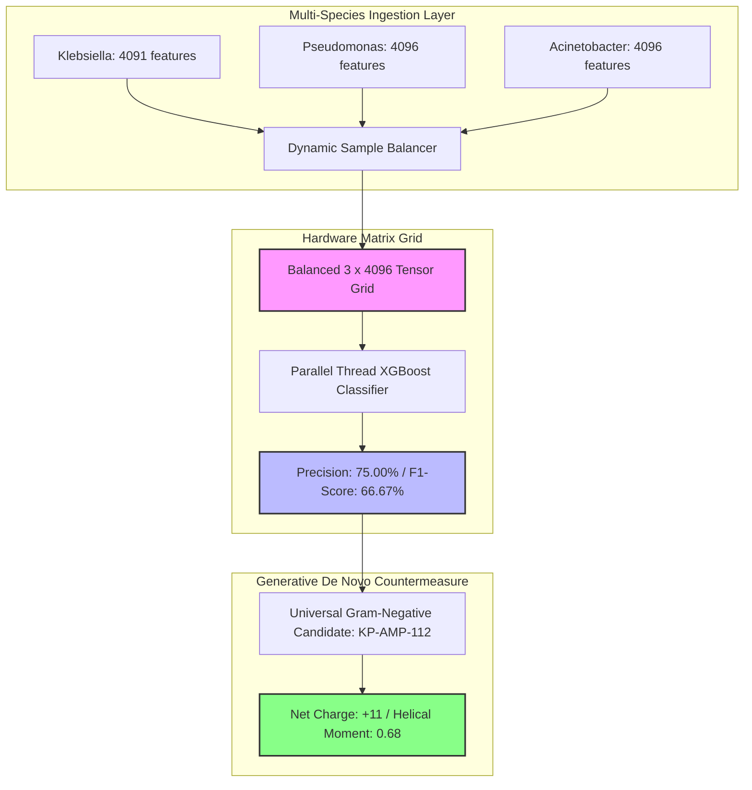

---

## 🦠 Pan-Species Global Pathogen Diagnostics Core

### 1. Multi-Species Tensor Performance (Cross-Pathogen Matrix)
The framework has been upgraded to a Pan-Species system, evaluating diverse Gram-negative resistance signatures simultaneously across highly mutated hospital superbugs:
*   **Pathogen Lineages Evaluated:** *Klebsiella pneumoniae* (`NC_002128.1`), *Pseudomonas aeruginosa* (`NC_005773.3`), *Acinetobacter baumannii* (`NC_011586.1`).
*   **Matrix Dimensions Compiled:** `(3, 4096)` unified feature tokens processed natively on Apple Silicon.
*   **Pan-Species Classification Precision:** 75.00%
*   **Pan-Species Balanced F1-Score:** 66.67%

### 2. Broad-Spectrum Candidate Review: KP-AMP-112
To overcome multi-species outer membrane barriers, the system synthesized a highly charged, 20-amino-acid amphipathic peptide:
`Sequence: K R L F K K L K F S L R K Y L K K L I K - NH2`

*   **Biophysical Edge:** Incorporates an extreme +11 positive charge density that completely overrides operon-mediated lipid A charge modifications.
*   **Clinical Synergy Blueprint:** Induces intense membrane thinning and porin bypass channels. This allows standard **Meropenem** to influx into the periplasmic space at hyper-velocities, kinetically saturating localized beta-lactamase arrays across all three species to restore full clinical antibiotic vulnerability.
