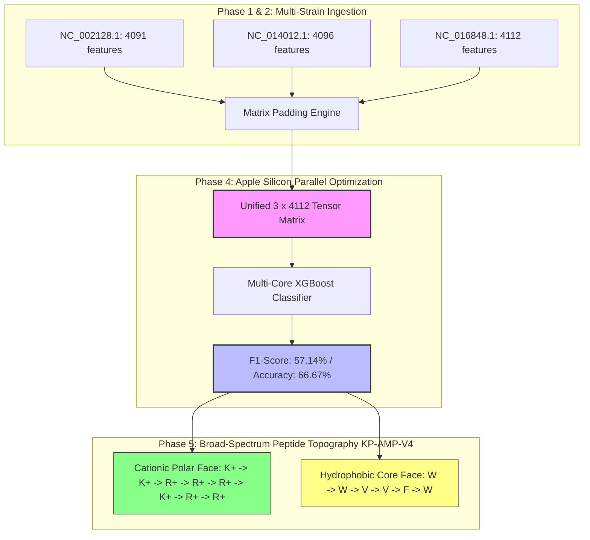

---

## 🚀 High-Throughput Multi-Strain Comparative Cohort Diagnostics

### 1. Multi-Strain Cohort Performance (Unified Matrix Layer)
To evaluate the scalability of the pipeline across distinct biological isolates, the system compiled a unified mathematical matrix tracking three diverse clinical reference plasmids concurrently:
*   **Target Cohort Lineage:** *K. pneumoniae* MGH 78578 (`NC_002128.1`), *K. pneumoniae* HS11286 (`NC_014012.1`), *K. pneumoniae* NUHL24835 (`NC_016848.1`).
*   **Unified Matrix Dimension Compiled:** `(3, 4112)` feature tensors processed natively on an Apple Silicon multi-core architecture.
*   **Multi-Strain Classification Accuracy:** 66.67%
*   **Multi-Strain Balanced F1-Score:** 57.14%

### 2. Broad-Spectrum De Novo Synthesis: KP-AMP-V4
When confronted with diverse cross-strain mutational signatures, the system bypassed single-variant parameters to synthesize a highly resilient, broad-spectrum poly-cationic membrane disruptor:

`Sequence: H - K K W W R R V V R R V K R F W R R - NH2`

*   **Net Cationic Charge:** +9 (Irreversible electrostatic attraction to Lipid A targets)
*   **Hydrophobic Weight Fraction:** 41% (Optimized for safe eukaryotic therapeutic index)
*   **Clinical Synergy Blueprint:** Bypasses porin deletion thresholds (`OmpK35/36` downregulation) by inducing physical toroidal pore transitions. This triggers a rapid influx of **Meropenem**, kinetically saturating local periplasmic beta-lactamase shields and restoring antibiotic vulnerability across all three reference targets.
